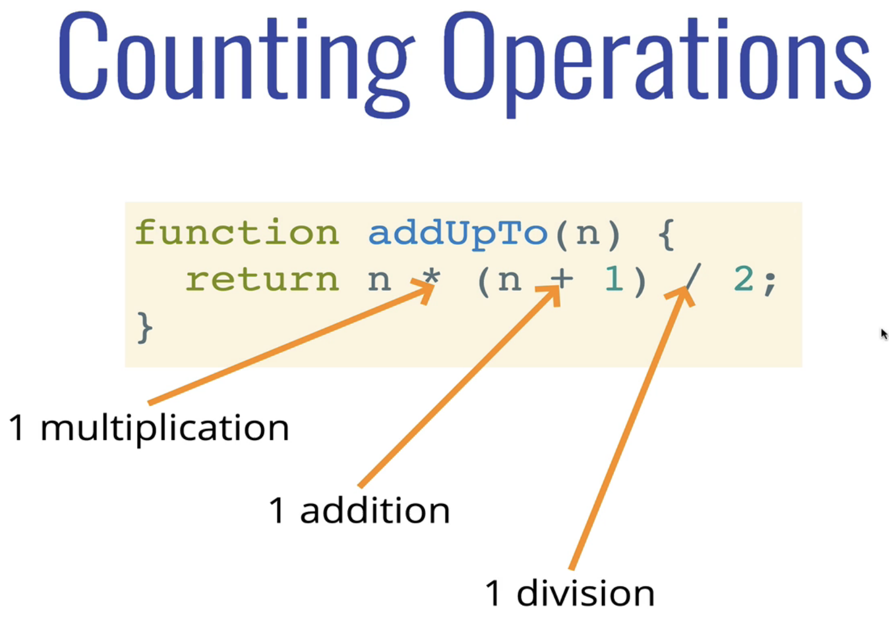
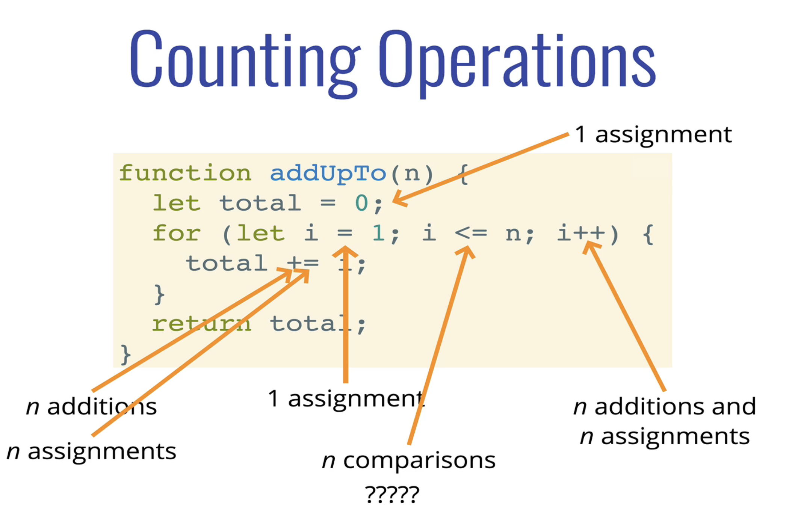

# Big O Notation

## Why do we need Big O?

1. It's important to have a precise vocabulary to talk about how our code performs
1. Useful for discussing trade-offs between different approaches 
1. When your code slows down or crashes, identifying parts of the code that are inefficient can help us find pain points in our applications 
1. It comes up in interviews! :(

## What does better mean? 

In majority of the cases, performance of programs are measured with the following benchmarks -

1. Is it faster? 
1. It is less memory-intensive? 
1. It the code more readable?

Computation speed is often used as a benchmark when comparing performance.

To compare which program is faster, we can make use of timers and then compare their computation times. 

Have a look at the `Example` folder which contains two programs that show their computation time.

## Why not use timers?

1. Different machines will record different times
1. The same machine will record different times! (Try running `add-with-loops.js` multiple times)
1. For fast algorithms, speed measurements may not be precise enough as the difference between their computation time will be very small.

## If not time, then what?

Rather than counting seconds which are so variable...,

We can count the number of simple operations the computer has to perform.

A few examples are shown below - 

Here the number of operations is 3.

Depending on what we count, the number of operations can be as low as 2n or as high as 5n + 2 But regardless of the exact number, the number of operations grows roughly proportionally with n.

## Introducing... Big 0

> Big O Notation is a way to formalize fuzzy counting

> It allows us to talk formally about how the runtime of an algorithm grows as the inputs grow

:warning: We won't care about the details, only the trends

> We say that an algorithm is O(f(n)) if the number of simple operations the computer has to do is eventually less than a constant times f(n), as n increases

In Big O, we talk about the worst case scenario or the upper bound for the runtime.

A few examples can be found below - 

:warning: In Big O, we always look at the big picture, we can safely ignore constants.

### Simplifying Big O Expressions

Here are a few things to keep in mind about Big O - 

1. Constants don't matter
1. Smaller terms don't matter
1. Arithmetic operations are constant
1. Variable assignment is constant 
1. Accessing elements in an array (by index) or object (by key) is constant 
1. In a loop, the the complexity is the length of the loop times the complexity of whatever happens inside of the loop

A few more examples - 

We always look at the worse case scenario or the upper bound for Big O; and for the `logAtMost5(n)` funtion, we come to realise that any value higher than 5 will result in the loop running 5 times. Therefore, the upper bound is capped at 5; and 5 being a constant value; the Big O for this function becomes `O(1)`.

Here is a graph for a few common Big O functions - 

### Space Complexity

We can also use big O notation to analyze space complexity.

Sometimes you'll hear the term `auxiliary space complexity` to refer to space required by the algorithm, not including space taken up by the inputs.

#### Space Complexity in JS

##### Rules of Thumb Most 

1. Primitives (booleans, numbers, undefined, null) are constant space
1. Strings require O(n) space (where n is the string length) 
1. Reference types are generally O(n), where n is the length (for arrays) or the number of keys (for objects)

Here is an example for Space Complexity - 

In the above example, space is oocupied by two variables - 

1. `let total = 0`
1. `let i = 0`

And the space for these two variables remain the same throughout the execution of the function. The length of the `for-loop` doesn't affect the space of the `total` variable. Hence, the space complexity is `O(1)`.

Another example is shown below - 

In the above function, we are creating a new array of size 0. And in the `for-loop`, we are adding elements to the array `n` times, where `n` is the size of the input array(`arr`). Thus, the space complexity in this case would be `O(n)`.

### Logrithmic Complexity

Certain searching algorithms have `logarithmic time complexity`. 

Efficient sorting algorithms involve logarithms. 

Recursion sometimes involves `logarithmic space complexity`.

## Recap 

1. To analyze the performance of an algorithm, we use Big O Notation.
1. Big O Notation can give us a high level understanding of the time or space complexity of an algorithm 
1. Big O Notation doesn't care about precision, only about general trends (linear? quadratic? constant?) 
1. The time or space complexity (as measured by Big O) depends only on the algorithm, **not** the hardware used to run the algorithm

## Big O in JS Objects

1. Insertion -> O(1) 
1. Removal -> O(1) 
1. Searching -> O(N) 
1. Access -> O(1) 

:warning: When you don't need any ordering, objects are an excellent choice! This is also the reason that insertion, removal and access in Objects is O(1).

### Big O of Object Methods 

1. Object.keys -> O(N) 
1. Object.values -> O(N)
1. Object.entries -> O(N)
1. hasOwnProperty -> O(1)

## Big O in JS Arrays

1. Insertion -> It depends. (O(N) if inserted at the beginning and O(1) if done at the end)
1. Removal -> It depends. (O(N) if deleted at the beginning and O(1) if done at the end)
1. Searching -> O(N) 
1. Access -> 0(1)

### When to use arrays

1. When you need order 
1. When you need fast access / insertion and removal (sort of....)

### Big 0 of Array Operations 

1. push -> O(1) 
1. pop -> O(1)
1. shift -> O(N)
1. unshift -> O(N) 
1. concat -> O(N)
1. slice -> O(N)
1. splice -> O(N)
1. sort -> O(N * log N)
1. forEach/map/filter/reduce/etc -> O(N)
